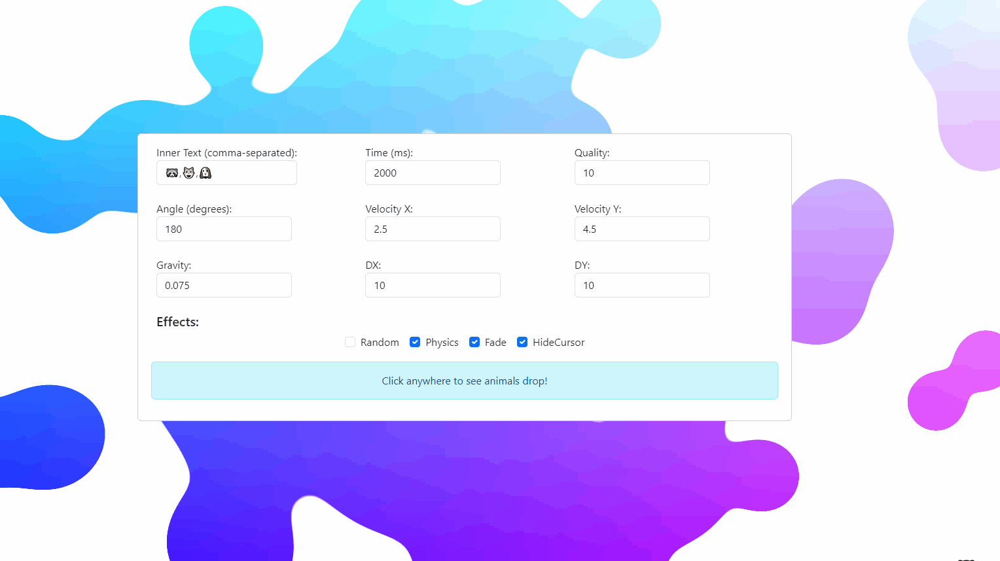

# Welcome to my personal website!

Hi! This website is built with **React + TypeScript + Vite**, and being currently worked on.

## [Metaball](https://longpanzhou.github.io/#/metaball.js)
You can find the code for the metaball background in [here](https://github.com/LongpanZhou/LongpanZhou.github.io/blob/main/src/metaball.js).


### Usage:
React.js, TypeScript, JavaScript
```javascript
import  './metaball.js';
```

HTML
```html
<script src="metaball.js"/>
```

## [Animal Clicks](https://longpanzhou.github.io/#/animalclicks)
You can find the code for cute animal cursor in [here](https://github.com/LongpanZhou/AnimalClicks)


### Usage:

React.js, TypeScript, JavaScript

1. Import Library (You might need to add @ts-ignore)
```javascript
//@ts-ignore
import  AnimalClicks  from  './index.js';
```
2. Define class
```javascript
new AnimalClicks(['🦝'],
    2000, 1, 180, 2.5, 4.5, 0.075, 10, 10,
    {
    random: false,
    physics: true,
    fade: true,
    hideCursor: true
	},
	'24px'
);
```

HTML
3. Define class in `index.js` first
```javascript
new AnimalClicks(['🦝'],
    2000, 1, 180, 2.5, 4.5, 0.075, 10, 10,
    {
    random: false,
    physics: true,
    fade: true,
    hideCursor: true
	},
	'24px'
);
```
4. Embed JavaScript
```html
<script src="index.js"/>
```

## Project Page
*Currently under development for this page :)*